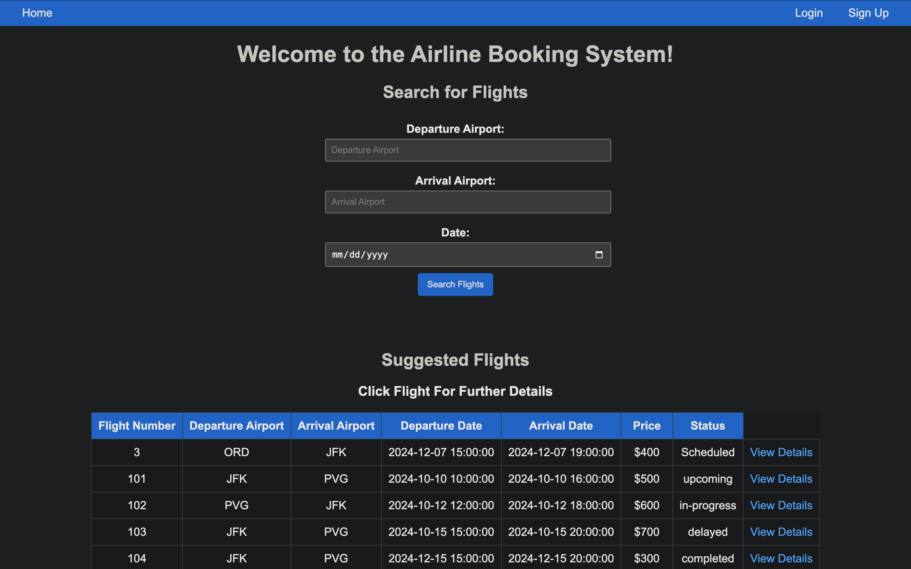
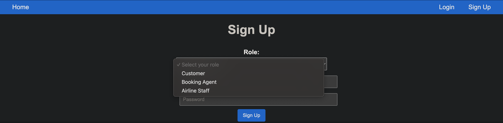
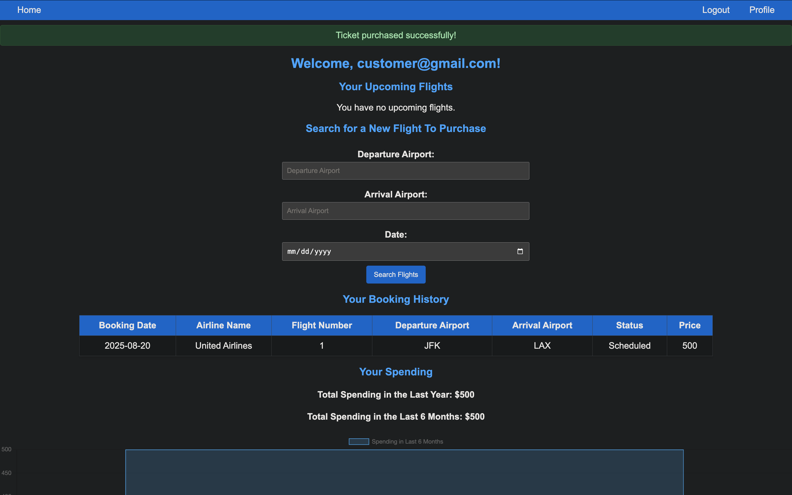
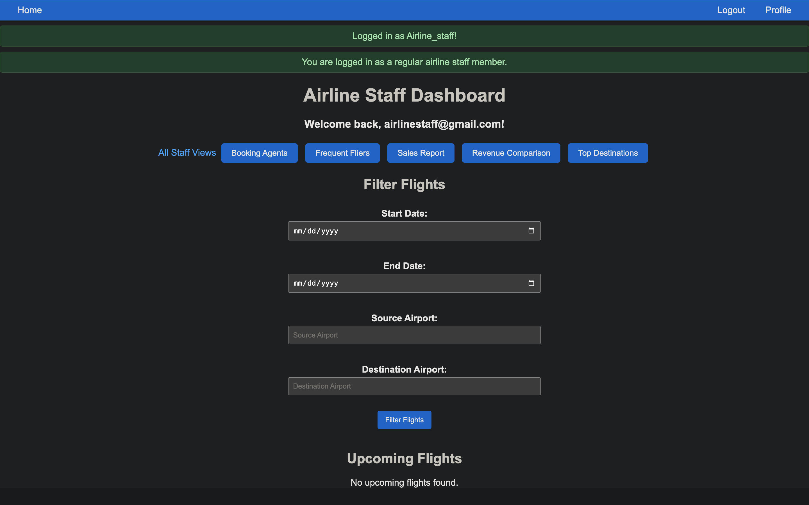

# Airline Project 
Full-stack web application to allow customers, booking agents, and airline staff to search, purchase, and manage flight tickets. Contains interactive dashboards using Chart.js to visualize revenue comparisons, customer spending, and flight data, 

## Screenshots

On the homepage, a guest can search for flights or look at suggested flights.

Users can choose to login or sign-up as a customer, agent, or staff.

Customers can buy tickets and look at their purchased tickets. Charts also show spending trends. 

Staffs can manage agents, check frequent fliers, and more. 

## Quick Start
Test Accounts
- Email: customer@gmail.com, bookingagent@gmail.com
- Password: customer, bookingagent, 

How To Run It On Your Own Computer
1. Download XAMPP and start Apache and MySQL
2. Go to http://localhost/phpmyadmin and import the given database
3. Download repository from github 
4. Run the following commands in the terminal

python3 -m venv venv
source venv/bin/activate
pip install -r requirements.txt
python app.py (or python3 app.py)